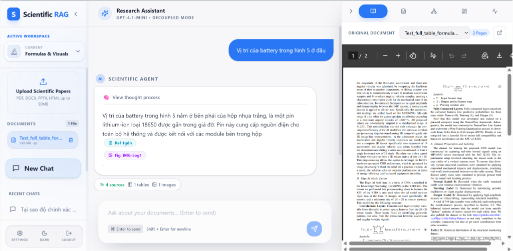
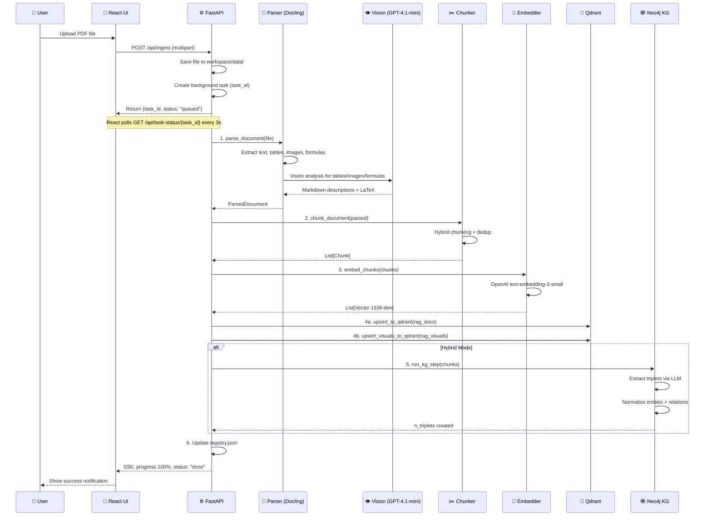
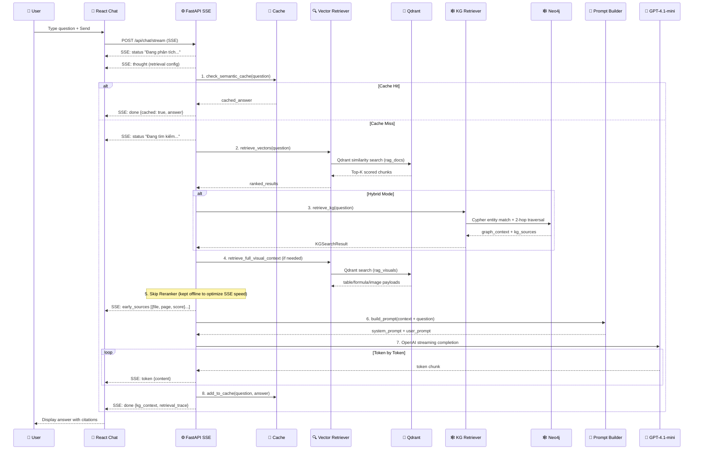

# 🔬 SciHybrid-RAG (RAG Balance)
### Hybrid Graph-Vector RAG System for Scientific Papers (PB-NOMA Research)

[](https://opensource.org/licenses/MIT)
[](https://www.python.org/downloads/)
[](https://react.dev/)
[](https://www.docker.com/)

**SciHybrid-RAG** (tên gốc: **RAG Balance**) là hệ thống **Retrieval-Augmented Generation lai (Hybrid)** chuyên sâu cho tài liệu khoa học phức tạp, cụ thể được tối ưu hóa cho bài toán nghiên cứu *PB-NOMA (Partial-Beam Non-Orthogonal Multiple Access)*. Hệ thống tích hợp song song cơ chế tìm kiếm ngữ nghĩa nhanh của **Vector Database** và khả năng suy luận mối quan hệ sâu của **Đồ thị tri thức (Knowledge Graph)**.

---

## 📺 Video Demo & Giao Diện Hệ Thống

### 🎥 [Xem Video Trực Quan Trên YouTube](https://www.youtube.com/watch?v=AkAaCEXnY_U)



*Giao diện 3 phân vùng (3-Pane Layout) đồng bộ thời gian thực: Sidebar quản lý tài liệu & Workspace, Màn hình chat trực quan hiển thị trích dẫn công thức LaTeX & ảnh, Trình xem PDF gốc hỗ trợ tự động cuộn đến trang trích dẫn.*

---

## 💡 Điểm Đột Phá Công Nghệ (Key Innovations)

Khác với các hệ thống RAG văn bản truyền thống thường bị mất thông tin khi gặp tài liệu khoa học nhiều công thức và hình ảnh, **SciHybrid-RAG** giải quyết triệt để bằng các công nghệ:

1. **Layout-Aware Parsing (IBM Docling v2.8+):** Thay vì cắt văn bản (chunking) mù quáng theo số ký tự, hệ thống phân tích cấu trúc phân đoạn (tiêu đề, bảng biểu, công thức, chú thích hình ảnh) để giữ nguyên ngữ cảnh khoa học.
2. **Visual & Mathematical Grounding (GPT-4.1-mini Vision):** Nhận diện các bảng biểu phức tạp và dịch trực tiếp các công thức toán học dạng ảnh sang định dạng chuẩn **LaTeX** để nhúng vào Vector DB.
3. **Hybrid retrieval (Qdrant + Neo4j Graph):**
   * **Qdrant (`rag_docs` + `rag_visuals`):** Tìm kiếm vector ngữ nghĩa nhanh cho các chunk văn bản và dữ liệu hình ảnh/bảng biểu.
   * **Neo4j Knowledge Graph (LightRAG):** Trích xuất các thực thể học thuật (`TECHNIQUE`, `METRIC`, `COMPONENT`, `CONCEPT`) và mối quan hệ để thực hiện duyệt đồ thị 2-hop (BFS), cung cấp ngữ cảnh liên kết chéo mà Vector Search đơn thuần bỏ sót.
4. **Semantic UMAP Visualization:** Chiếu không gian vector 1536 chiều của các chunk tài liệu xuống không gian 2D bằng thuật toán **UMAP**, giúp người dùng nhìn thấy trực quan "bản đồ tri thức" của tài liệu khoa học đang đọc.
5. **Real-time SSE Protocol Contract:** Giao thức Server-Sent Events (SSE) truyền dữ liệu streaming cực nhanh: cập nhật tiến trình suy nghĩ của Agent (`thought`), tải trước nguồn tài liệu nguồn (`early_sources`) giúp UI render PDF trước khi LLM bắt đầu trả về ký tự đầu tiên.

---

## 🏗️ Kiến Trúc Hệ Thống (Architecture)

### 1. Luồng Nhập Tài Liệu (Document Ingestion Flow)


### 2. Luồng Hỏi Đáp (Chat / Query Flow)
*(Lưu ý: Để tối ưu hóa tốc độ streaming qua SSE trực tuyến, mô hình Cross-Encoder Rerank được tạm thời tắt và giữ lại cho các tác vụ đánh giá offline)*


---

## ⚡ Quick Start — Khởi Chạy Nhanh Một Chạm (Dành cho Windows)

Dự án đã được tích hợp sẵn các kịch bản chạy tự động. Bạn chỉ cần thực hiện 2 bước đơn giản sau:

### Yêu cầu trước khi chạy:
* **Docker Desktop** đã được cài đặt và đang chạy.
* Có sẵn **OpenAI API Key**.

### Bước 1: Khởi tạo môi trường (Chỉ cần chạy 1 lần duy nhất)
Nhấp đúp chuột vào file **`setup.bat`** ở thư mục gốc của dự án hoặc chạy lệnh sau trong terminal:
```bat
.\setup.bat
```
*Script này sẽ tự động: cài đặt npm packages cho React frontend, tạo virtual environment Python (`venv`), cập nhật pip, cài đặt các dependency của Python Backend và xác minh môi trường.*

### Bước 2: Khởi chạy dự án
Đảm bảo hai cơ sở dữ liệu Docker đã chạy (xem phần Docker bên dưới), sau đó nhấp đúp chuột vào file **`run_dev.bat`** ở thư mục gốc:
```bat
.\run_dev.bat
```
*Script này sẽ tự động kích hoạt môi trường ảo, khởi động FastAPI server (Port `8000`) và khởi chạy React Dev Server (Port `5173`) cùng lúc.*

---

## 🐳 Cấu Hình Docker Cơ Sở Dữ Liệu (Qdrant & Neo4j)

Trước khi chạy ứng dụng, bạn cần khởi chạy các database container. Di chuyển vào các thư mục server tương ứng và chạy lệnh Docker:

### 1. Khởi động Qdrant (Vector Database)
```bash
cd backend/qdrant-server
docker compose up -d
```
* Dashboard quản lý Qdrant sẽ có tại: [http://localhost:6333/dashboard](http://localhost:6333/dashboard)

### 2. Khởi động Neo4j (Graph Database)
```bash
cd backend/neo4j-server
docker compose up -d
```
* Giao diện Neo4j Browser có tại: [http://localhost:7474](http://localhost:7474)
* **Tài khoản đăng nhập:** Username: `neo4j` | Password: `rag_password`

---

## ⚙️ Cấu Hình Biến Môi Trường (API Keys)

Nhân bản file cấu hình mẫu `.env.example` thành `.env` nằm trong thư mục `backend/` và điền API key của bạn vào:

```env
OPENAI_API_KEY="sk-proj-..."     # ← Điền OpenAI API key của bạn vào đây

# Các giá trị cơ sở dữ liệu (Giữ mặc định khi chạy Docker local)
QDRANT_HOST=localhost
QDRANT_PORT=6333
NEO4J_URI=bolt://localhost:7687
NEO4J_USERNAME=neo4j
NEO4J_PASSWORD=rag_password
```

---

## 📂 Cấu Trúc Dự Án (Project Structure)

```
SciHybrid-RAG/
├── backend/                # FastAPI Backend
│   ├── ingest/             # Module 1: Parser, Vision OCR, Chunker, Embedder
│   ├── query/              # Module 2: Retrieval Engine, Generator, Cache
│   ├── db/                 # Registry & cache metadata cục bộ
│   ├── data/               # Thư mục lưu trữ PDF đầu vào để Ingest
│   ├── workspaces/         # Dữ liệu cô lập cho từng Workspace của người dùng
│   ├── qdrant-server/      # Cấu hình Docker Compose cho Qdrant
│   ├── neo4j-server/       # Cấu hình Docker Compose cho Neo4j
│   ├── main.py             # FastAPI entry point, SSE controllers
│   ├── schemas.py          # Pydantic models (định nghĩa API types)
│   └── requirements.txt    # Các thư viện Python cần thiết
├── frontend/               # Frontend Client
│   ├── react-app/          # Giao diện chính React (Vite + TypeScript)
│   │   ├── src/
│   │   │   ├── components/ # Chat, PDF Viewer, Đồ thị D3.js, UMAP Viz
│   │   │   ├── store/      # Quản lý state bằng Zustand
│   │   │   └── api/        # SSE connection & API client
│   │   └── package.json
│   └── app.py              # Legacy Streamlit fallback UI (để debug)
├── .github/                # GitHub Configurations
│   └── workflows/
│       └── ci.yml          # GitHub Actions (CI) tự động build & test
├── LICENSE                 # MIT License
├── README.md               # File này
├── AGENTS.md               # Sách hướng dẫn cho AI Agents làm việc với codebase
├── PRD.md                  # Tài liệu yêu cầu sản phẩm ban đầu
└── PROGRESS.md             # Tiến độ hoàn thành các module
```

---

## 🧪 Chạy Thử Nghiệm Với CLI
Nếu bạn muốn thử nghiệm nhanh quá trình trích xuất tài liệu hoặc truy vấn không qua giao diện web:

1. **Ingest file PDF mẫu:** Đặt file PDF vào thư mục `backend/data/` và chạy:
   ```bash
   cd backend
   python -m ingest.pipeline --action ingest
   ```
2. **Liệt kê danh sách tài liệu đã ingest:**
   ```bash
   python -m ingest.pipeline --action list
   ```
3. **Truy vấn qua CLI Debugger:**
   ```bash
   python -m query.cli --query "PB-NOMA là gì và tại sao cần fuzzy clustering?"
   ```

---

## 📄 Bản Quyền & Giấy Phép (License)

Dự án này được cấp phép theo các điều khoản của **MIT License** - xem file [LICENSE](LICENSE) để biết thêm chi tiết.

---

*Hệ thống được phát triển với tinh thần tối giản hóa cấu trúc (Zero-LangChain/LangGraph) để đảm bảo hiệu năng tối ưu, tính cô lập luồng dữ liệu và khả năng kiểm soát tuyệt đối trên từng đoạn mã nguồn.*
