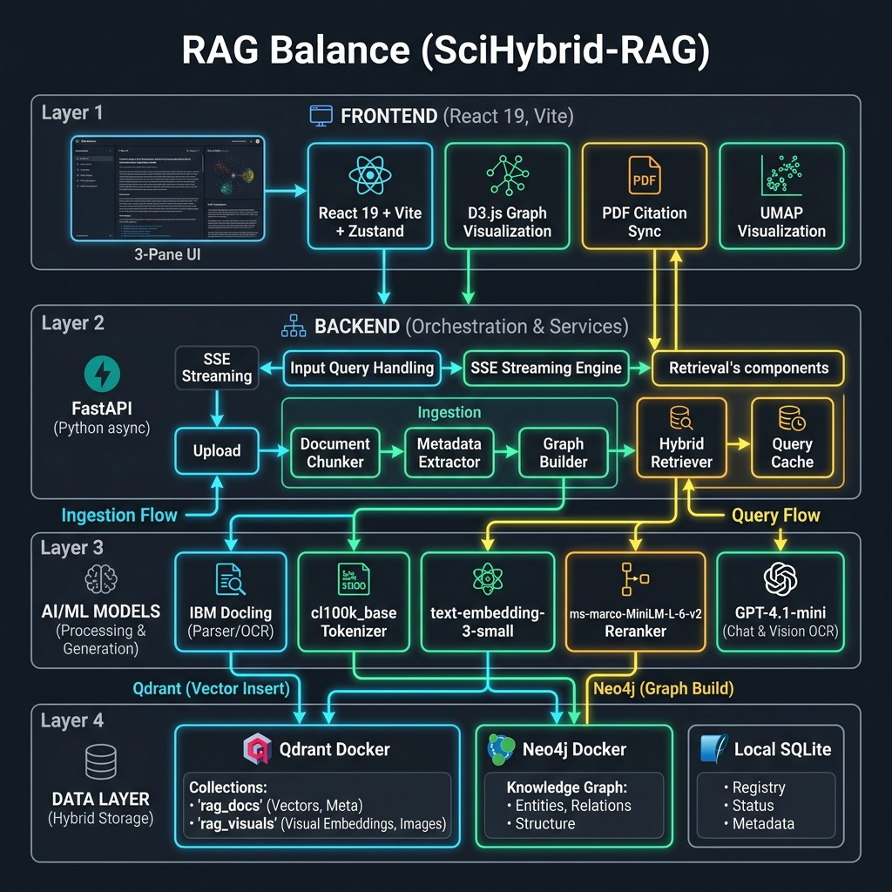
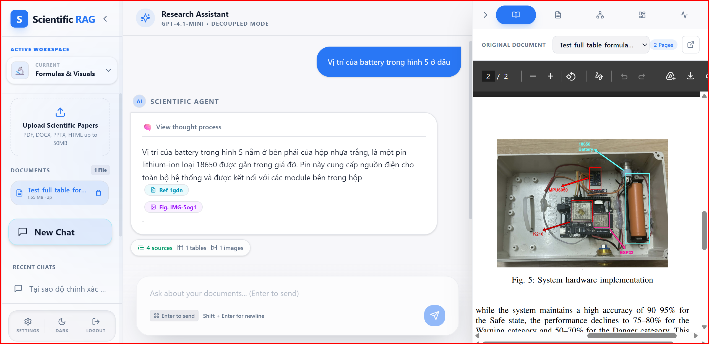
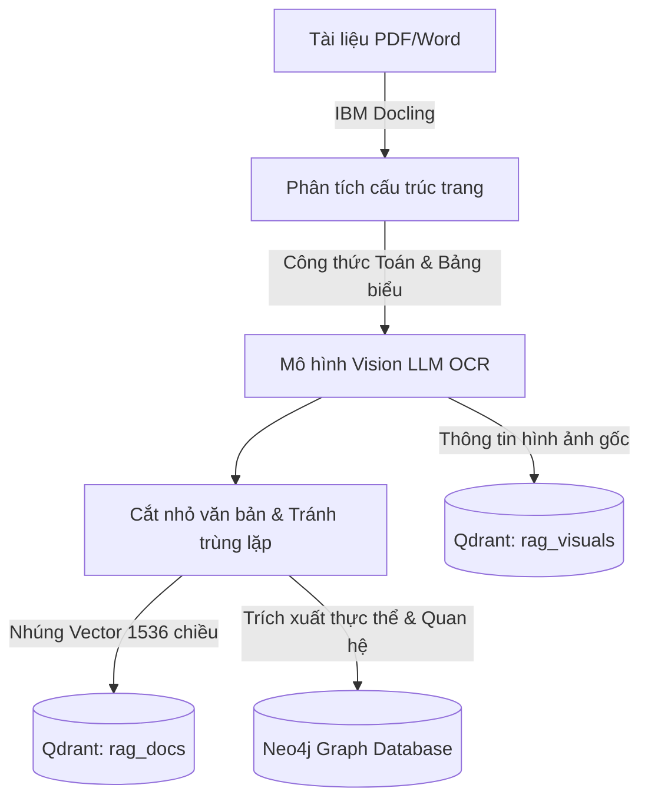
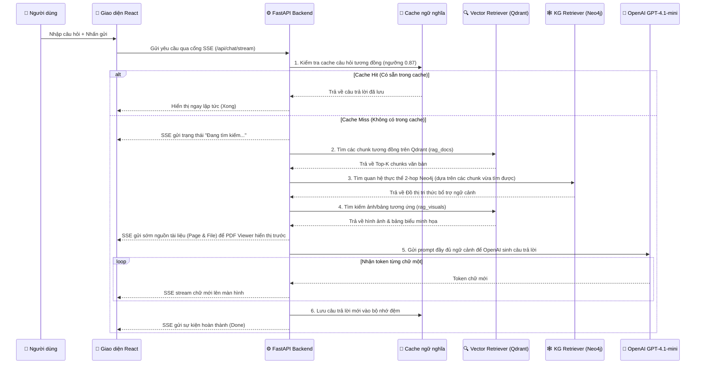

# RAG Balance (SciHybrid-RAG)
### Hệ thống Hybrid Graph-Vector RAG chuyên sâu cho tài liệu khoa học phức tạp

[](https://python.org)
[](https://react.dev)
[](https://fastapi.tiangolo.com)
[](https://docker.com)
[](LICENSE)

**Tải tài liệu PDF/Word lên. Trích xuất bảng biểu & dịch công thức toán học. Trả lời kèm trích dẫn trang PDF gốc.**

RAG Balance kết hợp tìm kiếm ngữ nghĩa nhanh của Vector Database (Qdrant), khả năng liên kết mối quan hệ của Đồ thị tri thức (Neo4j) và trích xuất tài liệu thông minh (IBM Docling) tạo thành một luồng RAG lai chuyên đọc bài báo khoa học.

[Tính năng](#tính-năng-nổi-bật-features) · [So sánh](#điểm-vượt-trội-so-với-rag-truyền-thống-beyond-traditional-rag) · [Kiến trúc](#kiến-trúc-hệ-thống-architecture) · [Khởi chạy nhanh](#hướng-dẫn-chạy-nhanh-quick-start) · [Công nghệ sử dụng](#chi-tiết-công-nghệ-sử-dụng-tech-stack)

---

## Kiến trúc hệ thống (Architecture)

<div align="center">



</div>

## Video Demo (Showcase)

<div align="center">

### 🎥 [Xem Video Trực Quan Trên YouTube](https://www.youtube.com/watch?v=AkAaCEXnY_U)



</div>

---

## Điểm vượt trội so với RAG truyền thống (Beyond Traditional RAG)

| Khía cạnh | RAG Truyền Thống | RAG Balance |
| :--- | :--- | :--- |
| **Đọc & Trích xuất** | Đọc text trơn thông thường, dễ làm mất cấu trúc cột, bảng biểu và chương mục | Sử dụng **IBM Docling**: Giữ nguyên cấu trúc phân cấp, trang, bảng |
| **Công thức Toán** | Bỏ qua hoàn toàn hoặc trích xuất ra ký tự lỗi | Cắt ảnh chứa công thức $\rightarrow$ dùng **GPT-Vision** dịch chính xác sang chữ LaTeX |
| **Ảnh & Bảng biểu** | Bỏ qua không xử lý | Crop ảnh $\rightarrow$ sinh caption $\rightarrow$ nhúng dạng vector lưu trữ song song |
| **Cắt nhỏ văn bản** | Cắt theo độ dài cố định, dễ bị đứt câu ở giữa | **Hybrid Chunker**: Gom cụm thông minh theo ngữ nghĩa và cấu trúc đề mục bài viết |
| **Phương thức Tìm kiếm** | Chỉ tìm kiếm Vector tương đồng gần đúng | **Lai kết hợp (Hybrid)**: Vector (Qdrant) + Đồ thị 2-hop (Neo4j) dựa trên các chunk điểm neo |
| **Đồ thị tri thức** | Không hỗ trợ | Trích xuất quan hệ thực thể $\rightarrow$ lưu Neo4j $\rightarrow$ truy vấn ngữ nghĩa |
| **Trích dẫn nguồn** | Không có hoặc hiển thị tên file chung chung | Gắn mã trích dẫn ngẫu nhiên 4 ký tự $\rightarrow$ click tự động nhảy tới trang PDF |
| **Không gian làm việc** | Dùng chung toàn bộ cơ sở dữ liệu | **Workspace Isolation**: Tách biệt thư mục và phân vùng DB cho từng dự án của user |

---

## Yêu cầu hệ thống (System Requirements)

* **Hệ điều hành**: Windows 10 hoặc Windows 11 (khuyên dùng để chạy các file script tự động hóa `.bat`).
* **Bộ nhớ RAM**: Tối thiểu 8GB RAM (Khuyên dùng 16GB để chạy mượt mà cùng lúc Docker Desktop, Node.js và Python Backend).
* **Bộ vi xử lý (CPU)**: 4-8 nhân vật lý (Docling cần tối thiểu 8 luồng CPU song song để chạy xử lý và phân tách tài liệu nhanh).
* **Card đồ họa (GPU)**: Không bắt buộc. Hệ thống mặc định chạy trên CPU. Nếu máy bạn có card đồ họa rời NVIDIA hỗ trợ CUDA, quá trình chạy cục bộ sẽ được tăng tốc đáng kể.
* **Dung lượng ổ cứng**: Còn trống tối thiểu 10GB (để chứa các ảnh Docker cho Qdrant, Neo4j và tải thư viện PyTorch nặng khoảng 2GB).

---

## Tính năng nổi bật (Features)

<details>
<summary><b>1. Trích xuất tài liệu khoa học thông minh (IBM Docling)</b></summary>

* Hỗ trợ đọc các định dạng phổ biến: PDF, DOCX, PPTX, HTML, HTM.
* Nhận diện cấu trúc phân cấp bài viết gồm tiêu đề chương mục (Header), danh sách (List items), phân đoạn văn bản và căn lề.
* Trích xuất trực tiếp các bảng dữ liệu thành định dạng Markdown hoàn chỉnh giúp giữ nguyên cột và dòng của bảng gốc.

</details>

<details>
<summary><b>2. Mắt thần dịch công thức & hình ảnh (VLM OCR)</b></summary>

* Nhận diện vùng chứa công thức toán học dưới dạng hình ảnh, tự động gọi Vision LLM (mặc định gpt-4.1-mini) dịch thành mã LaTeX dạng `$formula$`.
* Cắt ảnh sơ đồ, biểu đồ hoặc hình vẽ, dùng Vision model để viết mô tả chi tiết (caption) và lưu giữ vị trí (tọa độ trang) của ảnh đó.
* Nhúng phần mô tả và công thức LaTeX này trực tiếp vào các chunk chữ xung quanh dưới nhãn `VISUAL ENRICHMENT` giúp tìm kiếm vector dễ dàng quét trúng.

</details>

<details>
<summary><b>3. Cắt nhỏ văn bản thông minh & Tránh trùng lặp (Hybrid Chunker & Registry)</b></summary>

* Sử dụng bộ đếm Tokenizer cl100k_base (đồng bộ với OpenAI) để gom văn bản thành các đoạn tối đa 512 tokens mà không cắt nửa chừng câu.
* Tích hợp bộ đăng ký (registry.json) để tính toán mã hash SHA-256 của từng file. Nếu file đã tải lên trước đó, hệ thống sẽ bỏ qua, tránh nạp trùng lặp tốn dung lượng và chi phí API.
* Lọc bỏ các khối trùng lặp gần nhau (near-deduplication) dựa trên so sánh chữ mở đầu của đoạn.

</details>

<details>
<summary><b>4. Tìm kiếm lai kết hợp Đồ thị (Hybrid retrieval: Qdrant + Neo4j)</b></summary>

* Nhúng văn bản thành vector 1536 chiều bằng mô hình `text-embedding-3-small` rồi lưu vào Qdrant (phân vùng `rag_docs` cho chữ và `rag_visuals` cho ảnh/bảng).
* Đồ thị tri thức (Neo4j): Không tìm kiếm mù quáng, hệ thống sẽ lấy các chunk vector tìm thấy làm điểm neo (anchors), từ đó quét đồ thị xung quanh trong phạm vi 2-hop (Cypher query) để tìm các mối quan hệ thực thể liên quan trực tiếp.
* Reranker Cross-Encoder `ms-marco-MiniLM-L-6-v2` được tích hợp sẵn trong codebase phục vụ việc đánh giá và thử nghiệm offline (ở luồng online hỏi đáp, rerank tạm thời được bỏ qua để tối đa hóa tốc độ phản hồi streaming qua SSE).

</details>

<details>
<summary><b>5. Bộ nhớ đệm câu trả lời ngữ nghĩa (Semantic Cache)</b></summary>

* Lưu trữ các câu hỏi và câu trả lời cũ vào một cơ sở dữ liệu đệm.
* Khi có câu hỏi mới, hệ thống so sánh độ tương đồng vector của câu hỏi mới với các câu hỏi cũ trong cache. Nếu độ tương đồng vượt quá mức cấu hình (mặc định 0.87), hệ thống trả về câu trả lời có sẵn ngay lập tức mà không cần gọi GPT hay tra cứu DB, giúp tiết kiệm tiền API và trả lời trong 0.1 giây.

</details>

<details>
<summary><b>6. Không gian làm việc riêng biệt (Workspace Isolation)</b></summary>

* Mỗi người dùng hoặc dự án có một Workspace riêng (mặc định là `default`).
* File tải lên được cô lập hoàn toàn tại thư mục `backend/workspaces/{workspace_id}/data/`.
* Cơ sở dữ liệu đăng ký và lưu trữ tệp nằm riêng biệt tại `backend/workspaces/{workspace_id}/db/`.
* Các bản ghi vector trong Qdrant được phân mảnh và lọc bằng thuộc tính `workspace_id` để tránh dữ liệu bị lẫn lộn giữa các workspace.

</details>

<details>
<summary><b>7. Đồng bộ nguồn trích dẫn và tài liệu gốc (Citation & PDF Sync)</b></summary>

* Gắn mã trích dẫn ngẫu nhiên 4 ký tự ngắn gọn (ví dụ `[a3z1]` cho text, hoặc `[IMG-p4f2]`, `[FORM-t2y1]` cho hình ảnh/công thức).
* Giao diện 3 phân vùng (3-pane layout) liên kết chặt chẽ: khi người dùng nhấp chuột vào một mã trích dẫn trong câu trả lời, trình xem PDF ở khung bên cạnh sẽ tự động cuộn đến đúng số trang và vị trí của đoạn văn bản/hình ảnh được trích dẫn.

</details>

<details>
<summary><b>8. Bản đồ phân cụm tài liệu 2D (UMAP Chunk Visualization)</b></summary>

* Gọi thuật toán giảm chiều dữ liệu UMAP để chiếu các vector chunk 1536 chiều xuống không gian 2 chiều `(x, y)`.
* Hiển thị bản đồ phân bố các mảnh tài liệu trực quan trên giao diện web giúp người dùng thấy được mối quan hệ phân bố ngữ nghĩa giữa các chương mục bài viết.

</details>

<details>
<summary><b>9. Trực quan hóa đồ thị tri thức tương tác (Interactive Knowledge Graph)</b></summary>

* Vẽ sơ đồ mạng lưới thực thể khoa học thực tế bằng React Flow/D3.js từ dữ liệu quét thực thể của Neo4j.
* Hỗ trợ kéo thả, phóng to thu nhỏ, nhấp chọn đỉnh (node) để xem các mối quan hệ liên kết và xem các đoạn văn bản chứng cứ hỗ trợ.

</details>

<details>
<summary><b>10. Kiểm soát chi phí & Theo dõi luồng suy nghĩ (SSE Observability & Token Budgeting)</b></summary>

* Server-Sent Events (SSE) giúp đẩy tiến trình thực tế xuống giao diện theo thời gian thực (Status $\rightarrow$ Thought $\rightarrow$ Early Sources $\rightarrow$ Tokens $\rightarrow$ Done).
* Hiển thị hộp thoại "Luồng suy nghĩ" (Thought) để lập trình viên quan sát được các thông số tìm kiếm, cấu hình LLM trực tiếp.
* Bộ đếm và cắt gọn token tự động (`_enforce_input_token_budget`) giúp đảm bảo không bao giờ gửi quá giới hạn cửa sổ ngữ cảnh đầu vào của mô hình OpenAI, tránh lỗi hệ thống và tiết kiệm chi phí gọi API.

</details>

<details>
<summary><b>11. Thiết kế Giao diện người dùng trực quan (UI / UX Features)</b></summary>

* Giao diện 3 phân vùng hoạt động mượt mà không giật lag, chia tỉ lệ cột tự động co giãn.
* Các khung xem tài liệu PDF hỗ trợ phóng to, thu nhỏ và đồng bộ cuộn trang chính xác.
* Sơ đồ đồ thị tương tác có màu sắc phân loại thực thể rõ ràng, tự động highlight các liên kết liên quan khi di chuột qua.
* Hộp chat hỗ trợ định dạng Markdown đầy đủ, hiển thị các công thức toán học LaTeX trực quan và các thẻ trích dẫn đa phương tiện.

</details>

---

## Luồng hoạt động RAG (RAG Pipeline Flow)

### 1. Luồng nạp dữ liệu (Ingestion Flow)



### 2. Luồng hỏi đáp (Query Flow)



---

## Các cổng API chính (API Endpoints)

FastAPI Backend hỗ trợ các cổng API chính sau đây:
* `POST /api/chat/stream`: Stream câu trả lời theo thời gian thực kèm theo thông tin suy nghĩ (Thought) và nguồn tài liệu (SSE).
* `POST /api/ingest`: Tải lên và nạp tài liệu khoa học mới vào không gian làm việc.
* `GET /api/documents`: Lấy danh sách các tài liệu đã nạp thành công kèm theo số lượng chunk, số lượng ảnh, bảng biểu đã phân tích.
* `DELETE /api/documents/{file_name}`: Xóa tài liệu khỏi hệ thống.
* `GET /api/graph`: Lấy sơ đồ liên kết thực thể (Nodes & Edges) trong Neo4j của workspace hiện tại.
* `GET /api/umap`: Lấy tọa độ 2D của các chunk văn bản phục vụ biểu đồ UMAP.
* `GET /api/workspaces` & `POST /api/workspaces`: Xem danh sách và tạo không gian làm việc mới.

---

## Hướng dẫn chạy nhanh (Quick Start)

Bạn chỉ cần thực hiện đúng các bước sau đây để cài đặt và khởi chạy dự án:

### Bước 1: Những thứ cần chuẩn bị sẵn trên máy tính
1. **Docker Desktop**: Cần thiết để khởi động các cơ sở dữ liệu Qdrant và Neo4j. Hãy chắc chắn rằng bạn đã mở Docker Desktop lên trước khi chạy dự án.
2. **Node.js** (Phiên bản 20 hoặc mới hơn): Cần để chạy giao diện React.
3. **Python** (Phiên bản 3.10 hoặc mới hơn): Cần để chạy code xử lý dữ liệu backend.
4. **OpenAI API Key**: Cần có một khóa API của OpenAI (để gọi mô hình GPT dịch công thức và trả lời câu hỏi).

### Bước 2: Tạo file cấu hình và điền API Key
1. Bạn vào thư mục `backend/`.
2. Tìm file tên là `.env.example`.
3. Tạo một bản sao của file đó và đổi tên thành `.env`.
4. Mở file `.env` đó lên bằng Notepad hoặc VS Code.
5. Tìm dòng `OPENAI_API_KEY=sk-your-openai-api-key-here` và thay thế đoạn `sk-your-openai-api-key-here` bằng API key thật của bạn. Lưu file lại.

### Bước 3: Khởi động các cơ sở dữ liệu (Docker)
Mở terminal (như Command Prompt hoặc PowerShell) lên, di chuyển vào thư mục dự án và chạy các lệnh sau:

1. Chạy cơ sở dữ liệu Vector Qdrant:
   ```cmd
   cd backend/qdrant-server
   docker compose up -d
   ```
2. Chạy cơ sở dữ liệu Đồ thị Neo4j:
   ```cmd
   cd ../neo4j-server
   docker compose up -d
   ```
   *(Tài khoản mặc định của Neo4j là: Username: `neo4j` | Password: `rag_password`)*

### Bước 4: Chạy dự án (Chỉ cần 1 câu lệnh duy nhất)
Quay trở lại thư mục gốc của dự án (thư mục `A_RAG_MAIN`), mở terminal và gõ lệnh sau:
```cmd
.\run_dev.bat
```
**Lưu ý quan trọng ở lần đầu tiên chạy:**
* Khi bạn chạy lệnh này lần đầu tiên, file `.bat` sẽ tự động phát hiện máy bạn chưa cài đặt môi trường. Nó sẽ tự động gọi file `setup.bat` để cài đặt thư viện cho React và tạo môi trường ảo Python cho Backend.
* Quá trình này sẽ mất khoảng vài phút vì máy tính phải tải thư viện PyTorch khá nặng (~1.5GB đến 2GB). Hãy kiên nhẫn đợi cho đến khi nó chạy xong.
* Từ lần thứ 2 trở đi, lệnh này sẽ bỏ qua bước cài đặt và khởi động luôn giao diện + backend chỉ trong vòng 1 giây.

### Bước 5: Cách truy cập vào ứng dụng
Khi terminal chạy xong và báo thành công, bạn mở trình duyệt web lên và truy cập các địa chỉ sau:
* **Giao diện người dùng (React)**: http://localhost:5173
* **Trang quản trị Backend (FastAPI)**: http://localhost:8000/docs (Trang này dùng để xem các cổng API hoạt động thế nào)
* **Trang quản trị Vector Qdrant**: http://localhost:6333/dashboard
* **Trang quản trị Đồ thị Neo4j**: http://localhost:7474

### Mẹo cài đặt nhanh nếu máy mạng yếu hoặc không có card đồ họa GPU
Vì thư viện PyTorch mặc định tải về bản có hỗ trợ card đồ họa CUDA rất nặng (~2GB), nếu máy tính của bạn không có card đồ họa rời hoặc muốn tải nhanh hơn gấp 10 lần, bạn hãy làm như sau trước khi chạy file bat:
1. Mở terminal tại thư mục gốc của dự án.
2. Tạo môi trường ảo Python và kích hoạt nó:
   ```cmd
   cd backend
   python -m venv venv
   call venv\Scripts\activate
   ```
3. Chạy lệnh cài đặt phiên bản PyTorch CPU-only (bản này chỉ nặng khoảng 150MB):
   ```cmd
   pip install torch --index-url https://download.pytorch.org/whl/cpu
   ```
4. Sau đó bạn quay lại thư mục gốc và chạy file `.\run_dev.bat` như bình thường. Hệ thống sẽ tự động cài các thư viện còn lại mà không tải lại bản PyTorch nặng nữa.

---

## Chi tiết Công nghệ sử dụng (Tech Stack)

### 1. Backend (Phần phụ trợ)
| Thành phần | Công nghệ | Mục đích sử dụng |
| :--- | :--- | :--- |
| API Server | FastAPI | Xây dựng máy chủ HTTP bất đồng bộ hiệu năng cao |
| Server Runner | Uvicorn | Chạy server FastAPI ở cổng local 8000 |
| Trích xuất PDF | IBM Docling | Đọc, phân đoạn cấu trúc tài liệu PDF/Word/PowerPoint |
| Dịch công thức & Vision | OpenAI GPT-4.1-mini (Vision API) | Dịch ảnh công thức toán sang LaTeX và caption ảnh/bảng |
| Tokenizer | cl100k_base (tiktoken) | Đếm token để phân chia chunk chính xác với OpenAI |
| Xử lý ảnh | Pillow (PIL) | Cắt, xử lý định dạng ảnh trước khi gửi Vision API |
| Giảm chiều 2D | umap-learn | Tính toán tọa độ phân cụm cho biểu đồ UMAP |

### 2. Frontend (Phần giao diện)
| Thành phần | Công nghệ | Mục đích sử dụng |
| :--- | :--- | :--- |
| UI Framework | React 19 + Vite | Xây dựng giao diện web phản hồi nhanh |
| Ngôn ngữ | TypeScript | Đảm bảo tính chặt chẽ về mặt kiểu dữ liệu |
| Quản lý State | Zustand | Quản lý trạng thái workspace và chat |
| Vẽ Đồ Thị | React Flow / D3.js | Vẽ sơ đồ đồ thị mạng lưới thực thể tương tác |
| Định dạng CSS | Tailwind CSS | Thiết kế giao diện hiện đại và co giãn tốt |

### 3. Infrastructure (Cơ sở hạ tầng)
| Thành phần | Công nghệ | Mục đích sử dụng |
| :--- | :--- | :--- |
| Cơ sở dữ liệu Vector | Qdrant (Docker) | Lưu và tìm kiếm vector tương đồng (dimensions=1536) |
| Đồ thị tri thức | Neo4j (Docker) | Lưu trữ thực thể và quan hệ, thực hiện truy vấn Cypher |
| Môi trường chạy | Docker Desktop | Chạy cô lập cơ sở dữ liệu cục bộ |

---

## Cấu trúc thư mục của dự án

Dưới đây là sơ đồ các thư mục chính để bạn dễ hình dung:
* `backend/`: Chứa toàn bộ code xử lý logic, đọc file PDF, trích xuất dữ liệu và trả lời câu hỏi.
  * `ingest/`: Code để đọc file PDF, dịch công thức, cắt nhỏ văn bản và lưu vào cơ sở dữ liệu Qdrant.
  * `query/`: Code để tìm kiếm thông tin và gọi GPT trả lời.
  * `qdrant-server/` và `neo4j-server/`: Cấu hình Docker để chạy cơ sở dữ liệu vector và đồ thị.
  * `main.py`: File chạy chính của server backend.
  * `requirements.txt`: Danh sách các thư viện Python cần cài.
* `frontend/react-app/`: Chứa giao diện web để người dùng thao tác bấm nút, tải file và chat.
* `setup.bat`: File tự động cài đặt thư viện cho dự án ở lần đầu tiên.
* `run_dev.bat`: File chính dùng để khởi chạy dự án hàng ngày.

---

## Các câu hỏi thường gặp (FAQ) và Cách xử lý lỗi

* **Lỗi: Cổng 8000 hoặc 5173 đã bị phần mềm khác sử dụng**
  * *Cách sửa*: Bạn hãy kiểm tra xem có cửa sổ terminal nào khác đang chạy dự án này chưa tắt không. Hãy tắt hết các cửa sổ CMD cũ đi rồi chạy lại file `run_dev.bat`.
* **Lỗi: Không kết nối được cơ sở dữ liệu (Qdrant hoặc Neo4j)**
  * *Cách sửa*: Bạn hãy chắc chắn rằng bạn đã mở Docker Desktop lên và chạy hai câu lệnh khởi động database bằng Docker ở phần trên.
* **Lỗi: GPT trả lời không chính xác hoặc báo lỗi API**
  * *Cách sửa*: Hãy kiểm tra lại file `backend/.env` xem bạn đã điền đúng OpenAI API Key chưa, và tài khoản OpenAI của bạn còn tiền để gọi API hay không.

---

## Kế hoạch phát triển tiếp theo (Roadmap)

Dưới đây là các tính năng dự kiến sẽ được cập nhật thêm trong tương lai để dự án hoàn thiện hơn:
* Hỗ trợ thêm nhiều nhà cung cấp mô hình LLM khác ngoài OpenAI (ví dụ như mô hình chạy offline Ollama, mô hình Gemini...).
* Hoàn thiện tính năng phân tích và cô lập dữ liệu đồ thị tri thức chi tiết cho từng người dùng riêng biệt trên Neo4j.
* Tích hợp thêm các bộ đánh giá tự động (như RAGAS) để đo đạc độ chính xác của câu trả lời trực tiếp trên giao diện.
