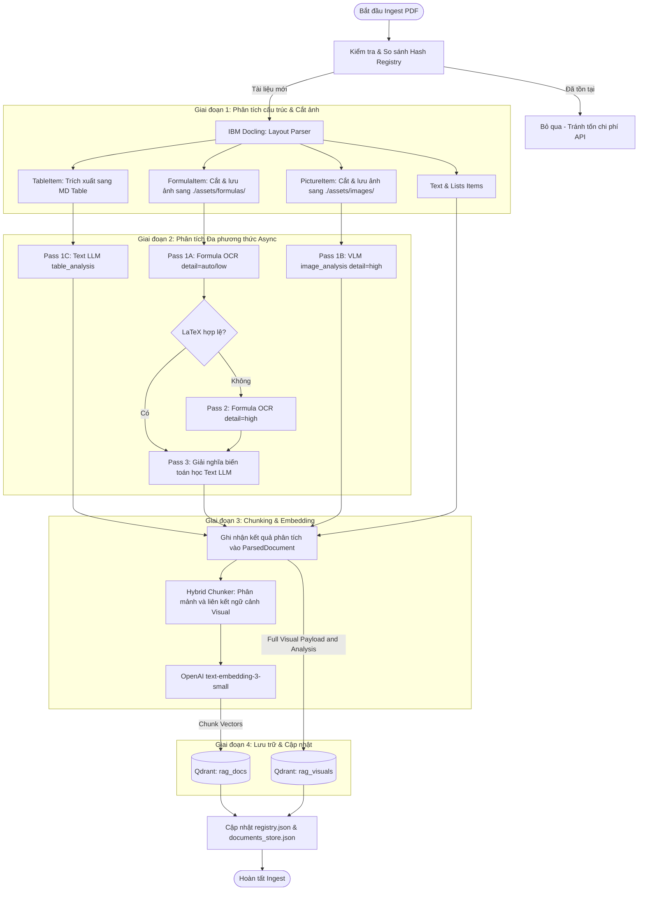
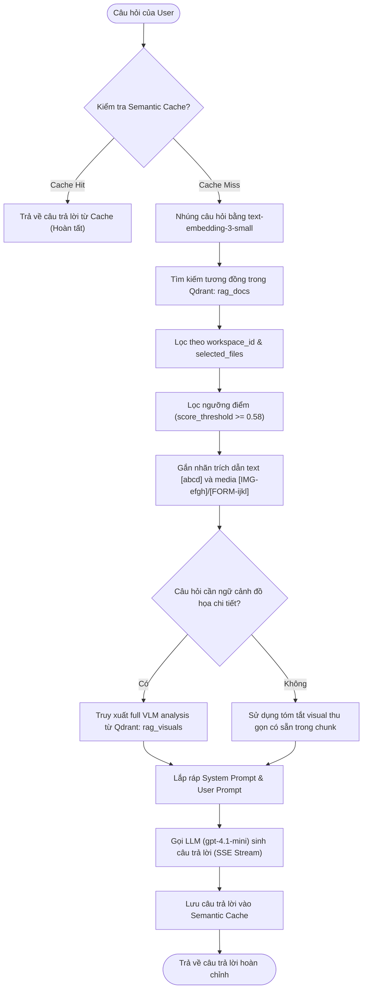

# Quy Trình Ingestion & Phân Tích Chế Độ Vector + Visual

Tài liệu này tổng hợp chi tiết về **Luồng xử lý (Analysis Flow)**, **Cấu trúc Prompts** và **Mô hình tính toán chi phí** của chế độ **Vector + Visual** (còn gọi là `only_vector_multimodal` trong hệ thống RAG Balance).

---

## 1. Bản Đồ Quy Trình Hoạt Động (Architecture Flow)

Chế độ **Vector + Visual** tập trung vào phân tích cấu trúc, trích xuất LaTeX của công thức, sinh tóm tắt biểu đồ/bảng biểu và lưu trữ vào Vector DB (Qdrant), đồng thời bỏ qua nhánh xây dựng Đồ thị Tri thức (Neo4j Knowledge Graph).



---

## 2. Chi Tiết Từng Bước Trong Luồng Xử Lý

### Bước 1: Khử Trùng Lặp Tài Liệu (Deduplication)
* Pipeline tính mã băm SHA256 (`calculate_file_hash`) của tệp PDF đầu vào.
* So khớp với tệp [registry.json](file:///c:/Users/admin/OneDrive/Desktop/A1_MinhChan/A_KLTN_RAG/ALL_ABOUT_RAG/A_RAG_MAIN/backend/db/registry.json). Nếu tệp đã có trong registry và không bật cờ đè (`force = True`), hệ thống lập tức dừng tiến trình cho tệp đó nhằm tiết kiệm 100% chi phí API.

### Bước 2: Phân Tích Layout Bằng IBM Docling (Layout Parsing)
* Tệp PDF được đọc thông qua bộ phân tích cấu trúc **IBM Docling**. Cấu hình chính:
  - `generate_picture_images = True` và `generate_page_images = True`.
  - Thiết lập `images_scale = 2.5` để render trang PDF thành ảnh chất lượng cao để crop ảnh sắc nét hơn.
* Docling phân loại tài liệu thành các khối (items):
  - **Văn bản thường & Danh sách (`TextItem`, `ListItem`):** Được lọc qua các mẫu biểu thức chính quy để sửa đổi các artifact lỗi font của Docling.
  - **Bảng biểu (`TableItem`):** Docling xuất ra bảng Markdown. Caption của bảng biểu được trích xuất ưu tiên từ metadata hoặc dòng đầu bảng.
  - **Hình ảnh (`PictureItem`):** Tự động crop từ ảnh trang PDF và lưu tại `./db/assets/{file_hash}/images/img_{page}_{idx}.png`.
  - **Công thức toán (`FormulaItem`):** Tự động crop vùng chứa công thức toán học và lưu tại `./db/assets/{file_hash}/formulas/formula_{page}_{idx}.png`.

### Bước 3: Phân Tích Hình Ảnh & Bảng Biểu Qua VLM (VLM Analysis)
Tất cả các hình ảnh, bảng biểu và công thức toán học được chuyển sang định dạng base64 và gửi lên OpenAI song song:
1. **Phân tích Bảng biểu (Pass 1C - Text only):** Gửi dữ liệu bảng biểu dạng Markdown và ngữ cảnh của văn bản xung quanh cho Text LLM phân tích cấu trúc, mục đích của bảng biểu và các điểm so sánh chính.
2. **Phân tích Hình vẽ (Pass 1B - detail="high"):** Gửi ảnh biểu đồ lên VLM ở chế độ phân giải cao (`high`). VLM phân tích: Nhãn trục X/Y, giá trị khóa, chú thích màu sắc, điểm số liệu nổi bật, và mô tả ngữ nghĩa 3-5 câu.
3. **Phân tích Công thức Toán học (Cơ chế 3-Pass):**
   * **Pass 1A (detail="auto"):** Gọi VLM ở chế độ mặc định. Đối với các crop công thức kích thước nhỏ, API tự động chuyển sang chế độ `low` (tốn **85 tokens**) để trích xuất mã LaTeX.
   * **Pass 2 (detail="high" - Chế độ phục hồi):** Sử dụng bộ lọc `_is_valid_latex` kiểm tra kết quả Pass 1A. Nếu bị đánh dấu lỗi (`[Not Decodable]`), hệ thống ép buộc gọi lại VLM ở chế độ `detail="high"` (tốn **255 tokens**) để phân tích ảnh phóng đại chi tiết, đảm bảo đọc đúng chỉ số mũ/chỉ số dưới.
   * **Pass 3 (Giải thích ngữ nghĩa):** Đưa LaTeX đã giải mã cùng văn bản bài viết xung quanh công thức toán học vào Text LLM để phân tích mục đích và giải nghĩa chi tiết các biến số.

### Bước 4: Hybrid Chunking & Đóng Gói Ngữ Cảnh (Enrichment)
* Kết quả phân tích (LaTeX sạch, mô tả hình ảnh, giải thích bảng biểu) được đập ngược trở lại cấu trúc tài liệu.
* Bộ phân mảnh `chunk_document` tiến hành cắt nhỏ tài liệu theo cấu trúc tiêu đề chương mục.
* **Enrichment:** Mọi chunk nằm gần hoặc chứa tham chiếu tới hình vẽ, bảng biểu, công thức toán học sẽ được tự động liên kết và chèn thêm văn bản giải nghĩa đa phương thức đã trích xuất từ VLM. Điều này giúp các truy vấn tìm kiếm chữ thông thường có thể khớp và tìm thấy hình ảnh/công thức chính xác.

### Bước 5: Tạo Vector Nhúng & Lưu Trữ (Vector Indexing)
* Đoạn văn bản đã làm giàu ngữ nghĩa được nhúng bằng model `text-embedding-3-small` (1536 chiều).
* Dữ liệu được lưu trữ song song vào hai collection trong Qdrant:
  - **`rag_docs`:** Lưu trữ các đoạn text chunks (vector nhúng và metadata).
  - **`rag_visuals`:** Lưu trữ chi tiết các phần tử đồ họa (LaTeX gốc, Crop ảnh vật lý, Caption, mô tả chi tiết của VLM).

---

## 3. Luồng Query của Chế Độ Vector + Visual

Khi người dùng gửi câu hỏi trong chế độ **Vector + Visual** (không sử dụng Knowledge Graph), hệ thống thực hiện truy xuất nhanh trực tiếp từ Qdrant và sinh câu trả lời theo sơ đồ sau:



### Các bước xử lý truy vấn:
1. **Kiểm tra bộ nhớ cache ngữ nghĩa (`check_semantic_cache`):** Tìm kiếm câu hỏi tương tự đã có câu trả lời trong cache để phản hồi lập tức.
2. **Nhúng câu hỏi (Query Embedding):** Chuyển đổi câu hỏi thành vector bằng `text-embedding-3-small`.
3. **Tìm kiếm Vector trên Qdrant (`retrieve_vectors`):** Truy xuất các chunk văn bản tương tự nhất từ collection `rag_docs`, lọc theo `workspace_id` và các tệp được chọn trong phiên làm việc.
4. **Lọc và lựa chọn ngữ cảnh (`select_retrieval_context`):** Bỏ qua bước Re-ranking để đạt tốc độ phản hồi tối ưu. Lọc các chunk có độ tương đồng cosine $\ge 0.58$.
5. **Gắn nhãn trích dẫn (`_attach_citation_ids`):** Gắn ID trích dẫn dạng ký tự ngẫu nhiên ngắn cho text (ví dụ: `[abcd]`) và các visual assets liên quan (ví dụ: `[IMG-efgh]`, `[FORM-ijkl]`).
6. **Bỏ qua Đồ thị Tri thức (KG Bypassed):** Vì cấu hình `kg_mode="none"`, hệ thống bỏ qua toàn bộ việc truy vấn đồ thị Cypher trên Neo4j.
7. **Trích xuất thông tin Đồ họa nâng cao (`retrieve_full_visual_context`):** Nếu câu hỏi chứa ý định tìm hiểu sâu về hình vẽ/công thức/bảng biểu, hệ thống sẽ thực hiện truy vấn thêm trên collection `rag_visuals` để lấy toàn bộ mô tả chi tiết từ kết quả phân tích VLM trước đó và đưa vào prompt.
8. **Lắp ráp và Sinh câu trả lời (`generate_answer`):** Trộn các tài liệu tham chiếu và chuyển tới mô hình `gpt-4.1-mini` để stream câu trả lời về cho Client (qua giao thức SSE).

---

## 4. Prompts VLM & LLM Hệ Thống Sử Dụng

### A. Prompt Phân tích Hình vẽ & Sơ đồ (`_PICTURE_ANALYSIS_PROMPT_TEMPLATE`)
* **Vị trí:** [backend/ingest/vision.py:L247-294](file:///c:/Users/admin/OneDrive/Desktop/A1_MinhChan/A_KLTN_RAG/ALL_ABOUT_RAG/A_RAG_MAIN/backend/ingest/vision.py#L247-L294)
* **Nhiệm vụ:** Yêu cầu VLM quét toàn bộ ảnh, nhận diện các sub-figures (a, b, c), nhãn trục X/Y, chú thích, số liệu nổi bật và viết một tóm tắt ngữ nghĩa khách quan.

### B. Prompt Trích xuất Công thức sang LaTeX (`_FORMULA_EXTRACTION_PROMPT`)
* **Vị trí:** [backend/ingest/vision.py:L402-446](file:///c:/Users/admin/OneDrive/Desktop/A1_MinhChan/A_KLTN_RAG/ALL_ABOUT_RAG/A_RAG_MAIN/backend/ingest/vision.py#L402-L446)
* **Nhiệm vụ:** Hoạt động như một hệ thống LaTeX OCR ép đầu ra chỉ trả về mã LaTeX thô, hỗ trợ phân biệt các ký hiệu đặc trưng và xử lý ảnh crop sát mép biên.

### C. Prompt Phân tích Giải thích Bảng biểu (`_TABLE_ANALYSIS_PROMPT_TEMPLATE`)
* **Vị trí:** [backend/ingest/vision.py:L323-354](file:///c:/Users/admin/OneDrive/Desktop/A1_MinhChan/A_KLTN_RAG/ALL_ABOUT_RAG/A_RAG_MAIN/backend/ingest/vision.py#L323-L354)
* **Nhiệm vụ:** Phân tích bảng biểu Markdown, liệt kê hàng/cột, đơn vị đo và ghi chú so sánh các giá trị khóa.

---

## 5. Mô Hình Tính Toán Chi Phí (Ví dụ Bài Báo 12 Trang)

Giả định cấu hình mặc định sử dụng model **`gpt-4.1-mini`** với đơn giá thiết lập trong hệ thống:
- **Input rate:** $0.400 / 1M tokens ($0.100 đối với cached input).
- **Output rate:** $1.600 / 1M tokens.

### Chi tiết ngân sách giả lập (40 Formulas + 6 Images + 3 Tables)

| Bước phân tích | Số lượng | Input Tokens / Item | Output Tokens / Item | Tổng Input Tokens | Tổng Output Tokens | Chi phí (gpt-4.1-mini) | Chi phí (gpt-4o-mini) |
| :--- | :---: | :---: | :---: | :---: | :---: | :---: | :---: |
| **Formula (Pass 1A)** | 40 | 685 | 40 | 27,400 | 1,600 | $0.01352 | $0.00507 |
| **Formula (Pass 2 Retry)** | 8 | 855 | 40 | 6,840 | 320 | $0.00325 | $0.00122 |
| **Formula (Pass 3 Analysis)** | 40 | 390 | 150 | 15,600 | 6,000 | $0.01584 | $0.00594 |
| **Images (Pass 1B)** | 6 | 1,465 | 400 | 8,790 | 2,400 | $0.00736 | $0.00276 |
| **Tables (Pass 1C)** | 3 | 1,950 | 350 | 5,850 | 1,050 | $0.00402 | $0.00151 |
| **TỔNG CỘNG / BÀI BÁO** | | | | **64,480** | **11,370** | **~$0.0440** (~1,080 VNĐ) | **~$0.0165** (~400 VNĐ) |

### Khuyến nghị tối ưu hóa chi phí:
Bạn có thể cấu hình lại tệp [.env](file:///c:/Users/admin/OneDrive/Desktop/A1_MinhChan/A_KLTN_RAG/ALL_ABOUT_RAG/A_RAG_MAIN/backend/.env) để chuyển đổi mô hình công thức và KG sang `gpt-4o-mini` (giúp giảm ngay **62% chi phí** xuống còn **~1.65 cents / bài báo**):
```ini
FORMULA_VLM_MODEL=gpt-4o-mini
KG_LLM_MODEL=gpt-4o-mini
```
